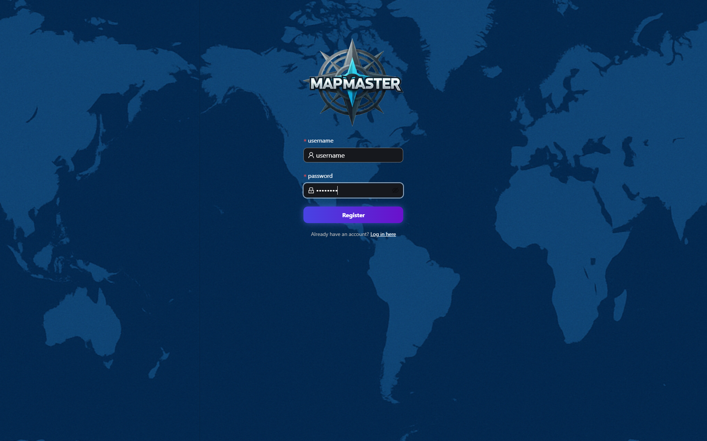
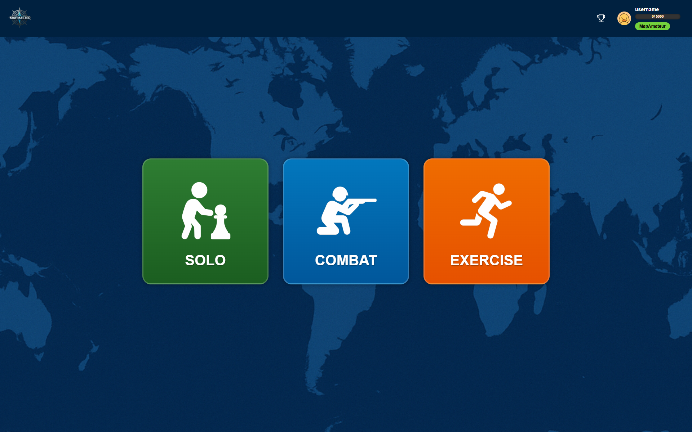
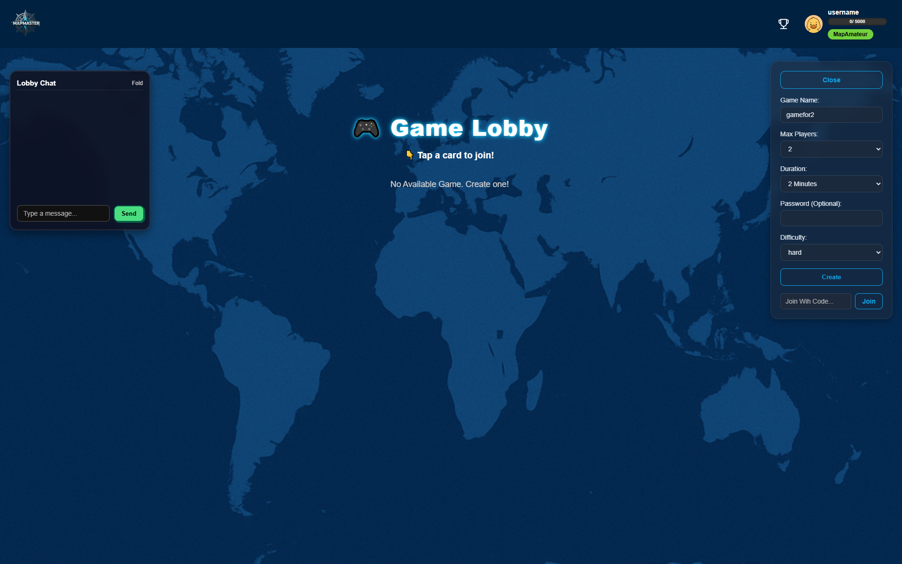
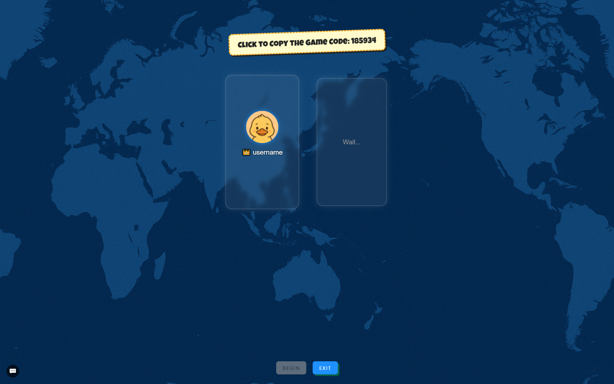
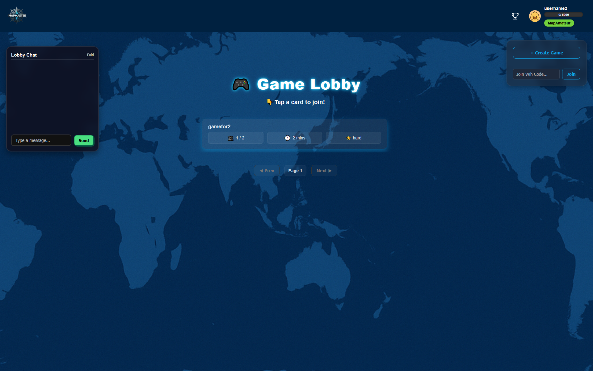
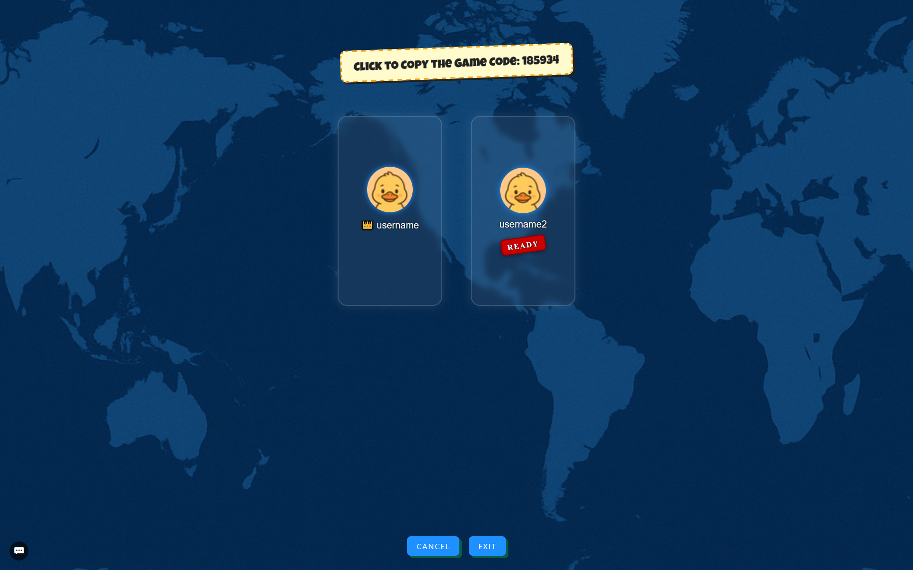
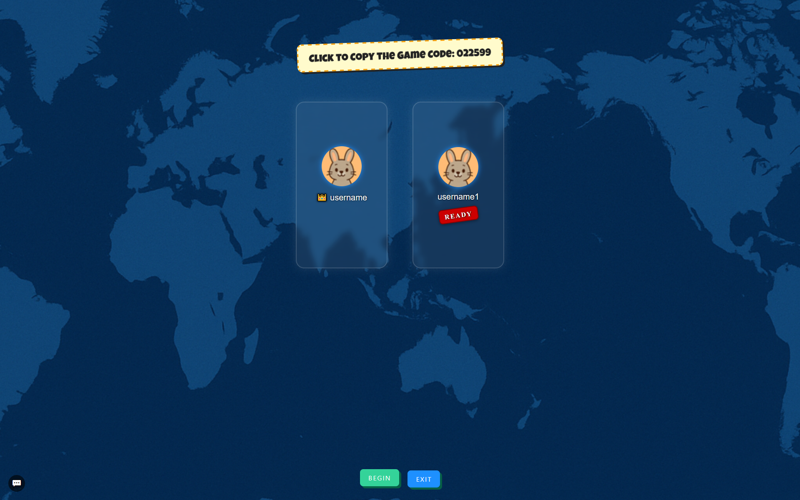

<p align="center">
  
</p>

<p align="center" style="font-size: 20px;">
  <i style="font-weight: bold;">One map to rule them all</i>
</p>

<h4 align="center">

[](https://github.com/T0hsakaR1n126/sopra-fs25-group-10-client/actions/workflows/build.yml)
[](https://github.com/T0hsakaR1n126/sopra-fs25-group-10-client/actions/workflows/dockerize.yml)
[](https://github.com/T0hsakaR1n126/sopra-fs25-group-10-client/actions/workflows/sonarcloud.yml)
[](https://github.com/T0hsakaR1n126/sopra-fs25-group-10-client/actions/workflows/verceldeployment.yml)


[](https://github.com/T0hsakaR1n126/sopra-fs25-group-10-client/graphs/contributors)
[](https://opensource.org/licenses/Apache-2.0)

<!-- [](https://github.com/T0hsakaR1n126/sopra-fs25-group-10-client/actions/workflows/preview.yml) -->

<h2 align="left">🧭 Introduction</h2> <strong>MapMaster</strong> is not just another geography game — it’s your new adventure across the globe! Dive into an interactive world map and put your knowledge to the test as you guess countries based on clever, progressively revealed hints about population, climate, history, and more. Whether you're flying solo, battling friends in multiplayer mode, or exploring at your own pace, MapMaster turns learning into a thrilling challenge. Powered by Spring Boot and cutting-edge frontend tech, this game delivers real-time interaction, smart scoring, and dynamic difficulty that keeps every round fresh and exciting. Ready to sharpen your geography skills and become a world map master? 
<h3 align="left">📌 Goal</h3> <p> MapMaster’s mission is simple: make geography *fun*, *engaging*, and *addictive*. It’s designed to help you boost your map smarts, recall countries faster, and compete with friends or players worldwide. Whether you’re a student, trivia buff, or travel fanatic, MapMaster offers a smooth, intuitive experience that’s perfect for all ages and skill levels. Get ready for fast-paced gameplay that turns learning into an unforgettable game! 
</p> <h3 align="left">📌 Motivation</h3> <p> Traditional geography drills can be dull. MapMaster was born to change that — transforming rote memorization into an exciting, interactive journey. In today’s world, keeping players hooked means blending education with entertainment seamlessly. Whether prepping for exams, teaching, or just indulging your curiosity, MapMaster is your go-to for a fresh, engaging way to connect with the world — one clue, one click, one country at a time. </p>


## :book: Table of content

- [Technologies](#technologies)
- [High-level components](#high-level-components)
- [Prerequisites & Installation](#prerequisites)
- [Illustration](#illustration)
- [Roadmap](#roadmap)
- [Troubleshooting Tips](#tips)
- [Authors](#authors)
- [Acknowledgment](#acknowledgement)
- [License](#license)

<a name="technologies"></a>
## Technologies

## 🛠️ Tech Stack
- **[React](https://react.dev/)** – Frontend JavaScript library for building interactive UIs, maintained by Meta.
- **[Next.js](https://nextjs.org/)** – React framework for server-side rendering, routing, and performance optimization.
- **[STOMP.js](https://stomp-js.github.io/stomp-websocket/)** – A simple text-oriented messaging protocol used over WebSocket.
- **[SockJS](https://github.com/sockjs)** – WebSocket emulation library ensuring fallback options for real-time communication.
- **[Spring Boot](https://spring.io/projects/spring-boot)** – Backend framework that simplifies building production-ready RESTful services in Java.
- **[OpenAI API](https://platform.openai.com/docs)** – Enables access to powerful AI models for intelligent text or chat interactions.
- **[Ant Design (AntD)](https://ant.design/)** – Enterprise-level React UI component library with elegant design and robust components.
- **[React Toastify](https://fkhadra.github.io/react-toastify/introduction/)** – Toast notifications made easy with auto-dismiss and theming.
- **[Redux Toolkit](https://redux-toolkit.js.org/)** – Modern and efficient Redux state management tool.
- **[D3 & D3-Geo](https://d3js.org/)** – For interactive geographic and data-driven visualizations.
- **[TopoJSON & World Atlas](https://github.com/topojson/topojson-client)** – Efficient encoding of geographic data for map rendering.
- **[Framer Motion](https://www.framer.com/motion/)** – Declarative animations and transitions for React.


<a name="illustration"></a>
## Illustration


### Main User Flow
1. **User Registration, Login and Game Modes:**
    - Users can register with username and password.
    - After registration, users will log in and access the game home and they will be able choose one of the game modes.

        <div style="text-align: center;">
            
        </div>
        <div style="text-align: center;">
            
        </div>
    
2. **Combat Mode and Lobby (Game Creation):**
    - We will see the most important mode called the "Combat" mode where multiple players can play a game together and compete against each other. 
    Clicking on Combat wil take you to the Lobby where you can create or join combat games.
    <div style="text-align: center;">
        
    </div>

    <div style="text-align: center;">
        
    </div>

3. **Lobby (Game Joinining):**
    <div style="text-align: center;">
        
    </div>
    <div style="text-align: center;">
        
    </div>


4. **Game Start:**
    <div style="text-align: center;">
        
    </div>


5. **Scoring:**


6. **Rounds:**

7. **Other Modes:**


<a name="high-level-components"></a>
## High level components

### [Gameroom]

The Gameroom page is the central interface for gameplay, displaying essential player information (name, avatar, readiness, round status, and score) on the left, based the current round. The top section features room details (name and theme) alongside a volume control for audio adjustments. On the right, a timer counts down each round, complemented by widgets showing current round details and reminders. The bottom-right contains audio recorders supporting recording, playing and reversing, an answer input field, and buttons for uploading/sharing and confirming answer validation. Before and after the game, the bottom-right area will have only the confirm ready pop up or the ranked leader board pop up showing the final result.

### [Lobby]

The lobby page serves as a navigation hub to various parts of the site. In the top-left, user information (avatar and name) is displayed; clicking here allows access to profile editing. The bottom-left features a logout button, redirecting users to the login/register page. Near the center, an animated info button activates a pop-up with game rules and buttons to activate mic and redirect to the rule guide page. On the right, a list of game rooms shows real-time details (current status, available seats, players, room theme, and name), each clickable to join a game directly from the lobby.

### [RuleGuide]

The Rule Guide page offers a step-by-step walk-through for new players, detailing each stage of a complete game round for both speaking and guessing roles. It features instructional messages and highlighted boxes to indicate necessary actions.

<a name="prerequisites"></a>
## Prerequisites & Installation

For your local development environment, you will need Node.js.\
We urge you to install the exact version **v22.10.0** which comes with the npm package manager. You can download it [here](https://nodejs.org/download/release/v22.10.0/).\
If you are confused about which download to choose, feel free to use these direct links:

- **MacOS:** [node-v22.10.0.pkg](https://nodejs.org/download/release/v22.10.0/node-v22.10.0.pkg)
- **Windows 32-bit:** [node-v22.10.0-x86.msi](https://nodejs.org/download/release/v22.10.0/node-v22.10.0-x86.msi)
- **Windows 64-bit:** [node-v22.10.0-x64.msi](https://nodejs.org/download/release/v22.10.0/node-v22.10.0-x64.msi)
- **Linux:** [node-v22.10.0.tar.xz](https://nodejs.org/dist/v22.10.0/node-v22.10.0-linux-x64.tar.xz) (use this [installation guide](https://github.com/nodejs/help/wiki/Installation#how-to-install-nodejs-via-binary-archive-on-linux) if you are new to Linux)

If you happen to have a package manager the following commands can be used:

- **Homebrew:** `brew install node@v22.10.0`
- **Chocolatey:** `choco install nodejs-lts --version=v22.10.0`

After the installation, update the npm package manager to **10.9.0** by running ```npm install -g npm@10.9.0```\
You can ensure the correct version of node and npm by running ```node -v``` and ```npm --version```, which should give you **v22.10.0** and **10.9.0** respectively.\
Before you start your application for the first time, run this command to install all other dependencies, including React:

```npm install```

Next, you can start the app with:

```npm run dev```

Now you can open [http://localhost:3000](http://localhost:3000) to view it in the browser.\
Notice that the page will reload if you make any edits. You will also see any lint errors in the console (use a Chrome-based browser).\
In order for these requests to work, you need to install and start the server as well.

```npm run lint```

Automatically check an format your code following predefined ESlint rules.


### Build
Finally, `npm run build` builds the app for production to the `build` folder.<br>
It correctly bundles React in production mode and optimizes the build for the best performance:\
The build is minified, and the filenames include hashes.<br>

See the section about [deployment](https://facebook.github.io/create-react-app/docs/deployment) for more information.

<a name="roadmap"></a>
## Roadmap

- :negative_squared_cross_mark: Implement a live chat feature.
- :negative_squared_cross_mark: Allow to finish each round earlier
- :negative_squared_cross_mark: Configurable setting of game rounds and word difficulty.
- :negative_squared_cross_mark: Optional re-match after a game ends.


<a name="authors"></a>
## Authors

| Name          | Personal page                                                                                                                                  |
|-------------------|----------------------------------------------------------------------------------------------------------------------------------------------- |
| Rohit KOONIREDDY  | [](https://github.com/rkoonireddy)  |
| Zheyuan FU        | [](https://github.com/T0hsakaR1n126) |
| Ziqi YANG         | [](https://github.com/yzq0325)      |
| Xinyu FU          | [](https://github.com/fuxinyu01)    |
| Jiawei Pei        | [](https://github.com/JaveyBae)   |

<a name="acknowledgement"></a>
### Acknowledgement

- The client code is based on the [SoPra FS25 - Client Template](https://github.com/HASEL-UZH/sopra-fs25-template-client).
- Many thanks to **[Silvan Schlegel](https://github.com/silvanschlegel)** who helped us as our TA and Scrum Master during this project.

<a name="license"></a>
## License
We publish the code under the terms of the [Apache 2.0 License](https://github.com/T0hsakaR1n126/sopra-fs25-group-10-client/blob/main/LICENSE) that allows distribution, modification, and commercial use. This software, however, comes without any warranty or liability.
