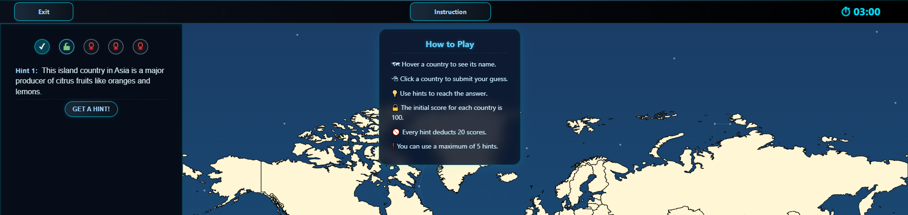
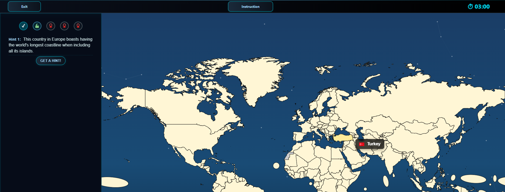

<p align="center">
  
</p>

<p align="center" style="font-size: 20px;">
  <i style="font-weight: bold;">One map to rule them all</i>
</p>

<h4 align="center">

[](https://github.com/T0hsakaR1n126/sopra-fs25-group-10-client/actions/workflows/build.yml)
[](https://github.com/T0hsakaR1n126/sopra-fs25-group-10-client/actions/workflows/dockerize.yml)
[](https://github.com/T0hsakaR1n126/sopra-fs25-group-10-client/actions/workflows/sonarcloud.yml)
[](https://github.com/T0hsakaR1n126/sopra-fs25-group-10-client/actions/workflows/verceldeployment.yml)


[](https://github.com/T0hsakaR1n126/sopra-fs25-group-10-client/graphs/contributors)
[](https://opensource.org/licenses/Apache-2.0)

<!-- [](https://github.com/T0hsakaR1n126/sopra-fs25-group-10-client/actions/workflows/preview.yml) -->

<h2 align="left">🧭 Introduction</h2> <strong>MapMaster</strong> is not just another geography game — it’s your new adventure across the globe! Dive into an interactive world map and put your knowledge to the test as you guess countries based on clever, progressively revealed hints about population, climate, history, and more. Whether you're flying solo, battling friends in multiplayer mode, or exploring at your own pace, MapMaster turns learning into a thrilling challenge. Powered by Spring Boot and cutting-edge frontend tech, this game delivers real-time interaction, smart scoring, and dynamic difficulty that keeps every round fresh and exciting. Ready to sharpen your geography skills and become a world map master? 
<h3 align="left">📌 Goal</h3> <p> MapMaster’s mission is simple: make geography *fun*, *engaging*, and *addictive*. It’s designed to help you boost your map smarts, recall countries faster, and compete with friends or players worldwide. Whether you’re a student, trivia buff, or travel fanatic, MapMaster offers a smooth, intuitive experience that’s perfect for all ages and skill levels. Get ready for fast-paced gameplay that turns learning into an unforgettable game! 
</p> <h3 align="left">📌 Motivation</h3> <p> Traditional geography drills can be dull. MapMaster was born to change that — transforming rote memorization into an exciting, interactive journey. In today’s world, keeping players hooked means blending education with entertainment seamlessly. Whether prepping for exams, teaching, or just indulging your curiosity, MapMaster is your go-to for a fresh, engaging way to connect with the world — one clue, one click, one country at a time. </p>


## Table of contents

- [Technologies](#technologies)
- [High-level components](#high-level-components)
- [Launch and Deployment](#launch-and-deployment)
- [Illustrations](#illustrations-and-game-flow)
- [Roadmap](#roadmap)
- [Authors](#authors)
- [Acknowledgment](#acknowledgement)
- [License](#license)

<a name="technologies"></a>

## Technologies
Frontend
- **[Next.js](https://nextjs.org/)** – Frontend framework we primarily used.
- **[React](https://react.dev/)** – Frontend JavaScript library for building interactive UIs, maintained by Meta.
- **[Vercel](https://vercel.com/)** – Cloud platform for static sites and serverless functions, optimized for Next.js deployments.
- **[STOMP.js](https://stomp-js.github.io/stomp-websocket/)** – A simple text-oriented messaging protocol used over WebSocket.
- **[SockJS](https://github.com/sockjs)** – WebSocket emulation library ensuring fallback options for real-time communication.
- **[OpenAI API](https://platform.openai.com/docs)** – Enables access to powerful AI models for intelligent text or chat interactions. We use it for clue generation for the countries dynamically.
- **[Ant Design (AntD)](https://ant.design/)** – Enterprise-level React UI component library with elegant design and robust components.
- **[React Toastify](https://fkhadra.github.io/react-toastify/introduction/)** – Toast notifications made easy with auto-dismiss and theming.
- **[Redux Toolkit](https://redux-toolkit.js.org/)** – Modern and efficient Redux state management tool.
- **[D3 & D3-Geo](https://d3js.org/)** – For interactive geographic and data-driven visualizations.
- **[TopoJSON & World Atlas](https://github.com/topojson/topojson-client)** – Efficient encoding of geographic data for map rendering.
- **[Framer Motion](https://www.framer.com/motion/)** – Declarative animations and transitions for React.
- **[Watchman](https://facebook.github.io/watchman/)** – Fast, efficient file-watching service by Meta that monitors project files for changes to trigger rebuilds or hot reloads during development.
- **[Nix](https://nixos.org/)** – Declarative package manager and reproducible development environment tool, ideal for consistent setups across machines and CI pipelines.
- **[Docker](https://www.docker.com/)** – Containerization platform to package and run applications consistently across environments.


<a name="high-level-components"></a>
## High level components
Here we show you the component tree at L1 for this repository where you see most key components of the game. We explain the ones that are most important both for the game play and functioning.
```
├── ReduxProvider.tsx
├── __tests__/
├── api/
├── auth/
├── favicon.ico
├── game/
├── gameSlice.ts
├── history/
├── hooks/
├── index.ts
├── layout.tsx
├── leaderboard/
├── lobby/
├── navbar.tsx
├── page.tsx
├── statistics/
├── styles/
├── types/
├── userSlice.ts
├── users/
└── utils/
```

### [`app`](./app)
Primary directory of the next app where all the frontend pages, logic, and hooks reside. The tree above is from this directory.

### Redux - [`userSlice and gameSlice`](./app/gameSlice.ts)
We use Reduxstore to maintain and process game and user states. We create slices for both to strategically navigate storage and access the local variables during a user's session. We setup the redux provider `ReduxProvider.tsx` accordingly.

### [`game`](./app/game/)
Core of the game play is hosted in the `game` directory which holds the access, creation, and playing the games; access the home page where all the game types are dispalyed [here](./app/game/page.tsx). Once user starts a user creates a game for others to join, they see other players, ready, and begin options [here](./app/game/start/[id]/page.tsx). The game itself will be displayed [here](./app/game/[id]/page.tsx)

### [`leaderboard`](./app/leaderboard/page.tsx)
Laderboard shows the top 10 players across the games. 

### [`hooks`](./app/hooks/)
Hooks folder holds some of the recurrent and crucial functionality we hold in the game. This includes important blocks such as [authorization](./app/hooks/authWrapper.tsx) and **[interative map](./app/hooks/interactiveMap.tsx). `Interactive Map` is the most important component of the game**. This holds the map visualisation and the interaction bits that are on the map. This hosts logic to display and also on the actions upon clicks.

### [`navbar`](./app/navbar.tsx)
Navigtion bar holds the home, user actions like checking [statistics](./app/statistics/page.tsx) and accessing user profile information, hone, and access to the leaderboard.

## Launch and Deployment
<a name="Launch and Deployment"></a>

You will need to \
For Frontend: `git clone https://github.com/T0hsakaR1n126/sopra-fs25-group-10-client` \
For Backend: `git clone https://github.com/T0hsakaR1n126/sopra-fs25-group-10-server`

**Optional (for full compatibility)**
 - You have to briefly follow the steps for `nix` set up so that the project's development environment is setup as required. You can follow follow more detailed instructions for your development setup [here](SetupScratch.md)
- Once you have installed `nix` and other pre-requisites, you will be prompted to allow `direnv`. Then please do `direnv allow`.

**Straight Forward Setup** 
- For your local development environment, you will need Node.js.\
You need to install the version **v22.10.0** which comes with the npm package manager. You can download it [here](https://nodejs.org/download/release/v22.10.0/).\
Feel free to use these direct links:
- **MacOS:** [node-v22.10.0.pkg](https://nodejs.org/download/release/v22.10.0/node-v22.10.0.pkg)
- **Windows 32-bit:** [node-v22.10.0-x86.msi](https://nodejs.org/download/release/v22.10.0/node-v22.10.0-x86.msi)
- **Windows 64-bit:** [node-v22.10.0-x64.msi](https://nodejs.org/download/release/v22.10.0/node-v22.10.0-x64.msi)
- **Linux:** [node-v22.10.0.tar.xz](https://nodejs.org/dist/v22.10.0/node-v22.10.0-linux-x64.tar.xz) (use this [installation guide](https://github.com/nodejs/help/wiki/Installation#how-to-install-nodejs-via-binary-archive-on-linux) if you are new to Linux)

If you happen to have a package manager the following commands can be used:

- **Homebrew:** `brew install node@v22.10.0`
- **Chocolatey:** `choco install nodejs-lts --version=v22.10.0`

After the installation, update the npm package manager to **10.9.0** by running ```npm install -g npm@10.9.0```\
You can ensure the correct version of node and npm by running ```node -v``` and ```npm --version```, which should give you **v22.10.0** and **10.9.0** respectively.\

Before you start your application for the first time, run this command to install all other dependencies, including React:\
```npm install```

Next, you can start the app with:\
```npm run dev```

Now you can open [http://localhost:3000](http://localhost:3000) to view it in the browser.\
Notice that the page will reload if you make any edits. You will also see any lint errors in the console (use a Chrome-based browser).\
In order for these requests to work, you need to install and start the server as well.

```npm run lint```
Automatically check an format your code following predefined ESlint rules.

### Build
Finally, `npm run build` builds the app for production to the `build` folder.<br>
It correctly bundles React in production mode and optimizes the build for the best performance:\
The build is minified, and the filenames include hashes.<br>

See the section about [deployment](https://facebook.github.io/create-react-app/docs/deployment) for more information.

<a name="illustration"></a>

## Illustrations and Game Flow
This  `.gif` image depicts our game flow rather quickly. This is aimed to help players understand game flow easily. 


### Main User Flow
This section explains some intricacies of the game modes, instructions/ game rules, and the scoring logic.

1. **User Registration, Login and Game Modes:**
    - Users can register with username and password.
    - After registration, users will log in and access the game home and they will be able choose one of the game modes.
    
2. **Combat Mode and Lobby (Game Creation):**
    - We will see the most important mode called the "Combat" mode where multiple players can play a game together and compete against each other. 
    Clicking on Combat wil take you to the Lobby where you can create or join combat games.

    **Combat mode** is where a group of players can compete against each other. A maximum number of 5 players are allowed (currently). There is one leader (who starts the game) and the rest can join either using a passcode or a game password. Once all the players are ready, the leader can start the game.

3. **Lobby (Game Joinining):**'
    Users can create or join game in the game lobby. Game lobby represents all the ongoing combat games. This also provides a "community/lobby chat" function similar to live stream chat. 

    Users can either join a game with open places or create their own game for other to join. If they are joining someone else's game, they can set status to ready. Once everyone is ready game leader gets to start the game. 

4. **Game Start:**
    Game starts with the set time during the creation and clock runs till the end of that time. Each player can guess as many questions as they want during this time. Players will be able to see each other's score during the game.

5. **Scoring:**
    As depicted here, in the combat mode and the solo mode, each user can score a `maximum of 100 points per country`. If none of the hidden hints are used. Each hint will cost the user `20 points`. 
    For example: If a user uses all the hints and guesses the question correct they will get 20 points. If the user guesses the question wrong they will get `0 points`.

    Highest point winning player is announced as the winner.
    <div style="text-align: center;">
        
    </div>

    <div style="text-align: center;">
        
    </div>
    
    <div style="text-align: center;">
        
    </div>

6. **Other Modes:**

    <div style="text-align: center;">
        
    </div>

    <div style="text-align: center;">
        
    </div>

<a name="roadmap"></a>

## Roadmap

- [ ] 🔄 Guest players can join games without registration  - partially implemented
- [ ] 🔄 Team vs Team gameplay mode  - partially implemented
- [ ] Configurable settings:  
  - [ ] Select continents or countries to be tested on  
  - [ ] Choose difficulty levels
- [ ] Add other themes such as cities, rivers, food etc.
- [ ] Ability to end a round early  
- [ ] 🔄 Live chat feature in the ongoing game – Lobby and Game start chat available, can be extended for within game
- [ ] Ability to set a different time limit in combat mode when players want to play another round.


<a name="authors"></a>

## Authors

| Name          | Personal page                                                                                                                                  |
|-------------------|----------------------------------------------------------------------------------------------------------------------------------------------- |
| Rohit KOONIREDDY  | [](https://github.com/rkoonireddy)  |
| Zheyuan FU        | [](https://github.com/T0hsakaR1n126) |
| Ziqi YANG         | [](https://github.com/yzq0325)      |
| Xinyu FU          | [](https://github.com/fuxinyu01)    |
| Jiawei Pei        | [](https://github.com/JaveyBae)   |

<a name="acknowledgement"></a>
### Acknowledgement

- This repository code derives the framework from the kind **UZH HASEL team** provided [SoPra FS25 - Client Template](https://github.com/HASEL-UZH/sopra-fs25-template-client).
- Many thanks to **[Silvan Schlegel](https://github.com/silvanschlegel)** who helped us as our TA and Scrum Master during this project.

<a name="license"></a>
## License
We publish the code under the terms of the [Apache 2.0 License](https://github.com/T0hsakaR1n126/sopra-fs25-group-10-client/blob/main/LICENSE) that allows distribution, modification, and commercial use. This software, however, comes without any warranty or liability.
